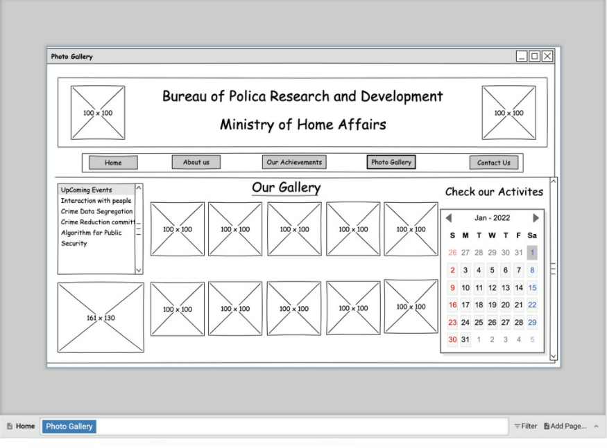
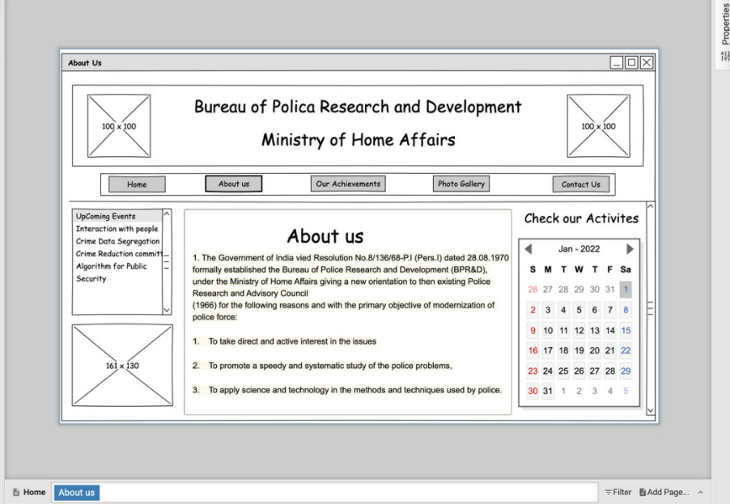
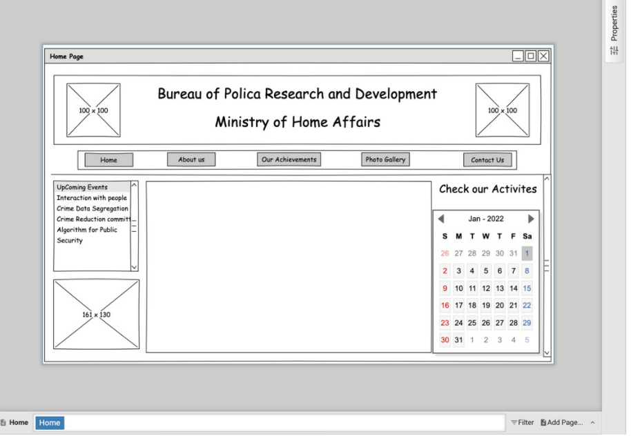

# Wire frame for a website

## AIM:
To design a wire frame for a website.

## DESIGN STEPS:

### Step 1:
Resize canvas to website layout

### Step 2:
Follow a grid and make a website box

### step 3:
Input required elements

## OUTPUT:

## Result:
Thus a wire frame is designed for a given website.
